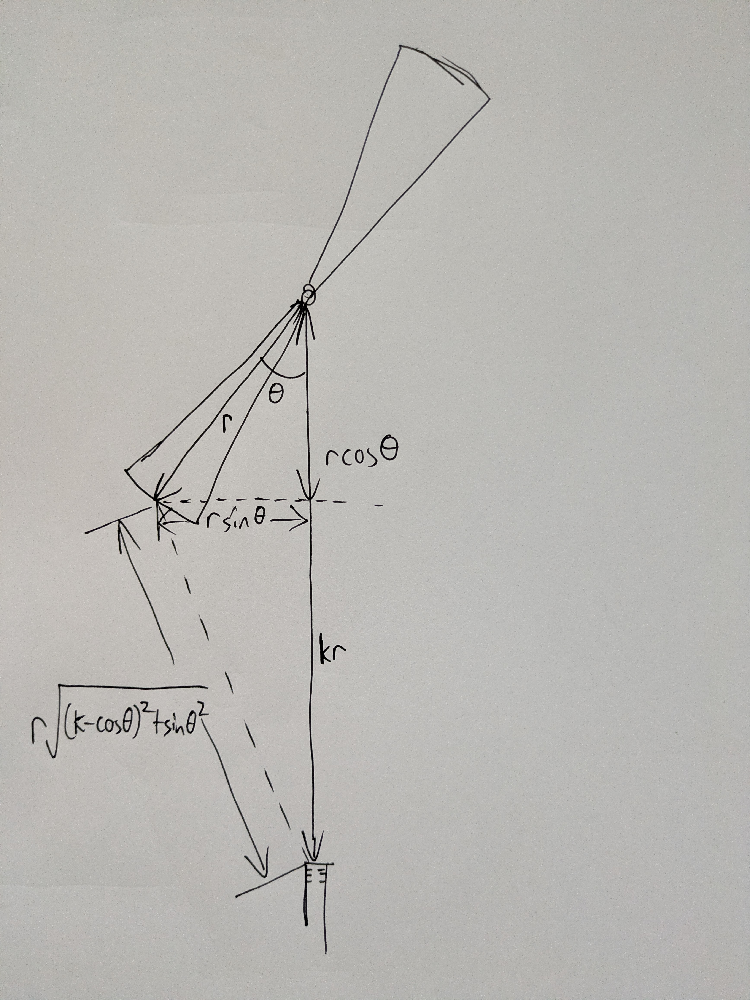

# Aunt Leslie
This JUCE project is a chorus ensemble effect with synchronized low-pass filter to emulate a Leslie speaker.

## Concept
### Leslie speaker basics
The Leslie speaker passes the sound output of a set of drivers through a set of rotors, which direct the sound as they rotate. The rotation creates a pleasing variation in the sound; as the rotors move, they shorten and lengthen the path the sound must travel, and also change its timbre.

It was originally designed to work with the Hammond organ, and is part of the characteristic classic Hammond sound.

### Chorus ensemble
The chorus ensemble effect is a purely electronic effect that produces some of the same effect as a Leslie speaker. Chorus ensemble effects were first developed sometime in the 1970s, based on the development of the bucket brigade device (BBD) in 1969. The bucket brigade essentially acts like an analogue sampling shift register: it stores charges in a chain of capacitors, and passes these charge values along to allow a snippet of analogue sound to be stored and read out at the other end of the chain.

Roland produced a seminal chorus ensemble effect using this technology in about 1976; my RS-202 and Juno 60 both essentially use this circuit. In the chorus ensemble, the same variable path-length that the Leslie produces physically is produced electronically using BBDs run at slightly variable rates, meaning the time for the sound to travel through the entire BBD varies slightly with time.

### A fully electronic Leslie
The chorus ensemble is itself a hugely beloved effect, but it has no effect on the timbre of the sound beyond the variable delay introduced by the BBD. I wanted to add in a synchronized low-pass filter to mimic the difference between a rotary speaker element facing towards, and away from, the listener.

I also wanted to be able to vary the position of virtual "microphones" by using the delay line more flexibly; in a computer, random access of the delay line is extremely easy, so you can pick your delay very precisely.

This plugin aims to simulate the geometry and filtering characteristics of the Leslie speaker, but also to permit some configurations which are physically impossible with a real one—such as driving the two treble horns with different input channels.

## Specifics of the Leslie
### The Leslie 760
Some of the numbers given here are from sources given in the references section, but I plan to make measurements of my own unit, a Leslie 760.

I was inspired to get this because of the way George Harrison's Leslie made his guitar sound in *The Beatles: Get Back*, which is to say, magical.

My unit has two rotors: a treble rotor with two horns, and a bass rotor with a wedge-shaped reflector inside a rotating cylinder. This is a fairly standard configuration for a Leslie speaker.

I wanted to have a real Leslie speaker because it would allow me to place microphones wherever I wanted to give, for instance, a stereo chorus (this worked very well).

### Treble rotor
The treble rotor has a radius of about 204mm, and rotates at about 36RPM in the chorale setting and 380RPM in the tremolo setting. When shifting between settings, the rotor is accelerated or braked at a constant rate, taking about a second to adjust speed.

### Bass rotor
I need to oil the lower motor assembly, and when I next get in there I'll measure it.

## The Effect
### Phase shift mathematics
The input signal will be shifted by a variable amount depending on a function designed to mimic the audio path through a Leslie speaker. A classic BBD chorus simply uses a sine function, but a lovely characteristic feature of a real Leslie is that the delay is slightly more complex, leading to an asymmetrical throb, particularly in the tremolo setting.

### Treble rotor geometry

The treble rotor consists of two horns, facing in opposite directions, rotating around a common centre. A driver at the centre passes sound into the throat of both horns, and it is projected up each to the end of the horn.

Let the treble rotor radius be $r$.

A microphone is placed at a distance from the centre of the treble rotor. For reasons that will shortly be obvious, let this distance be a multiple $k$ of the treble rotor radius.

The treble rotor rotates clockwise as seen from above. Let the angle of rotation at a given time, with respect to the axis from the centre of the treble rotor to the microphone, be $\theta$.

The sound first has to travel a distance $r$ up the treble horn, and it then leaves at the end and travels a further distance to the microphone.

That distance is the hypotenuse of a right triangle. One side of the right triangle is $rsin\theta$, the sideways displacement of the treble horn. The other side is $kr - rcos\theta$, that is, the total distance from the centre of the treble horn to the microphone, less the longitudinal displacement of the treble horn. Thus, the hypotenuse of the right triangle has length $r\sqrt{(k - \cos\theta)^2 + \sin^2\theta}$.

Thus the total distance travelled is:

$r[1 + \sqrt{(k - \cos\theta)^2 + \sin^2\theta}]$

And hopefully now it's obvious why I chose to make the microphone distance a multiple of the treble rotor radius!

### Accounting for both horns and stereo input
Since there are two horns, we will model two delay lines and sum their outputs.

Since the plugin will have a stereo input, this gives us an opportunity to choose what signal we send to each horn. We will have three switchable modes:

- summed stereo to both horns
- left input to one horn, right input to the other
- stereo difference to one horn, inverted stereo difference to the other

Who knows what that'll sound like, but I *wanted* to use stereo difference with my real Leslie and obviously, physically, I can't. So why not?

### Bass rotor geometry
The bass rotor geometry can be considered to work identically to the treble rotor, except that it only has one wedge to the treble rotor's two horns.

### Stereo microphone placement
For my actual recording of the Leslie 760, I placed the microphones at right angles. Therefore, for this first version of the plugin, we will do the same. Using the original expression for the right microphone, we obtain the expression for the left microphone by substituting $\sin$ for $\cos$ and $-\cos$ for $\sin$. This means the stereo microphone geometries will be:

Right: $r[1 + \sqrt{(k - \cos\theta)^2 + \sin^2\theta}]$

Left: $r[1 + \sqrt{(k - \sin\theta)^2 + \cos^2\theta}]$

A more advanced future version will allow for a variable phase shift between microphones, and indeed possibly more than two microphones if we're getting excitable.

### Filter mathematics
For now we simply use:

Right: $cos\theta$

Left: $sin\theta$

Using the same definition of $\theta$ above. We will use this to modulate the cutoff frequency of a simple discrete filter, finding a good level experimentally.

A more sophisticated analysis, involving the tendency for higher frequency sounds to be more directional, will come in a future version.

### Motor assemblies and rotor speed
Most of the time, the rotor will operate at a constant RPM, which we call constant speed mode. There are two speeds, tremolo (fast) and chorale (slow). However, it is desirable, when switching between them, that the change is smooth and realistic.

Both treble and bass rotors are driven by essentially the same kind of motor assembly: a pulley is either driven directly by a large motor, or through an idler spindle by a small one. Therefore, the acceleration and braking moments should be identical for both rotors, and the physical differences driven entirely by the pulley ratios and moment of inertia.

The bass rotor has considerably more moment of inertia than the treble rotor, so will tend to speed up and slow down more gradually; the large motor is quite powerful and so can attain full speed relatively quickly, whereas the small motor spindle exerts a smaller braking moment and so the rotor will slow quite gradually.

In all cases, this can be boiled down to a constant acceleration rate $k$, so the acceleration is governed by

$\ddot{\theta} = k$

which gives a solution of the form

$\dot{\theta} = kt + a$

$\theta = \frac{kt^2}{2} + at + b$

When the motor speed change is activated, we will take the current value of $\theta = \theta_0$ as $b$, and the current value of $\dot{\theta} = \dot{\theta_0}$ as $a$. Thus, rearranging the expression for $\dot{\theta}$:

$t = \frac{\dot{\theta}_{\text{target}} - \dot{\theta}_0}{k}$

gives the length of time the system must use the square expression to accelerate before returning to constant speed mode.

In future, there will be a continuously variable speed function, called VFD mode, inspired by the VFD-driven rotary speakers built by Sam Battle that can run at any speed at all. It might even be fun to drive the motor harder when the input signal is larger. Absolute scenes.

## The Name
Aunt Leslie is named after a song by Vulfpeck. Treat yourself.

## References

Much of the electrical and mechanical detail:
- https://synthfool.com/docs/Leslie/Leslie_760_User_And_Servicemanual/

Rotor speeds:
- https://organforum.com/forums/forum/electronic-organs-midi/leslies-tone-cabinets-speakers-accessories/41662-leslie-rotor-speeds
- https://www.dairiki.org/HammondWiki/LeslieRotationSpeed

Sam Battle's VFD-driven Leslie:
- https://www.youtube.com/watch?v=BuxLnKO7X8k&
- https://www.youtube.com/watch?v=ZemaoRTeqr8

Vulfpeck:
- https://www.vulfpeck.com/
- https://www.youtube.com/watch?v=t2pz6uNiheg